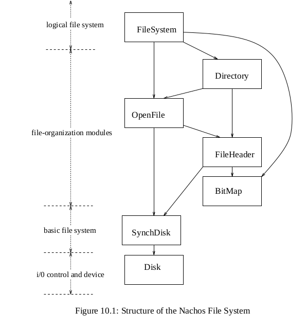

# 文件系统　实习报告


**姓名：青宇　　学号：190121%$$$$**

**日期：2019/11/20**

<div STYLE="page-break-after: always;"></div>
**目录**

[TOC]

<div STYLE="page-break-after: always;"></div>
## 内容一：总体概述

#### 背景描述

>  Nachos文件系统建立在模拟磁盘上，提供了基本的文件操作，如创建、删除、读取、写入等等。文件的逻辑结构与物理位置之间的映射关系由文件系统统一维护，用户只需通过文件名即可对文件进行操作。
>
>  然而，相比于实际文件系统，Nachos文件系统还存在很多不足之处：
>
> - 文件长度的限制
>
>  Nachos文件系统采用直接索引方式，故文件长度不能超过4KB（更准确的说，是((128 – 2 * 4) / 4) * 128 = 3840 B）。同时，文件的长度必须在创建时予以指定，且不得更改。
>
> - 文件数目的限制
>
>  Nachos文件系统只有一级目录，系统中所有的文件都存于根目录下，且数目不能多于10个。
>
> - 粗粒度的同步互斥机制
>
>  Nachos文件系统每次只允许一个线程访问，不支持多个线程同时访问文件系统。
>
> - 性能优化与容错
>
>  Nachos文件系统没有Cache机制，也没有容错机制，即当文件系统正在使用时，如果系统突然中断，文件内容的正确性无法保证。

#### 实习建议

> - 数据结构的修改和维护
>
>  文件管理的升级基于对原有Nachos数据结构的修改。增加文件的描述信息需对文件头结构进行简单修改。多级目录中可创建目录也可创建文件，应根据实际的文件类型初始化文件头信息。
>
> - 实现多级目录应当注意
>
> 	- 目录文件的含义。每个目录对应一个文件，通过此文件可了解其子目录及父目录的信息。
>
>    - Nachos的目录文件大小是预先定义的，但实际上，目录文件的大小应根据内容确定，且能改变。
>
>    - 实现多级目录后，添加、删除目录项要根据具体的路径，对树的遍历要有深刻的理解。
>
>    - 为了实现文件长度无限，可以采取混合索引的分配方式。

本次实验主要内容是结合操作系统课堂上讲解的原理内容，通过修改Nachos系统的底层源代码，达到“完善文件系统”的目标。其中涉及到了文件的基本组织方式，文件目录结构及其存储方式，以及结合上个lab，完善Nachos文件系统的同步互斥机制，最后在以上基础上对文件系统的性能进行优化．


## 内容二：任务完成情况

任务完成列表

| 第一部分     | Exercise 1     | Exercise 2      | Exercise 3      |
| ------------ | -------------- | --------------- | --------------- |
|              | Y              | Y               | N               |
| **第二部分** | **Exercise 4** | **Exercise 5**  | **Exercise 6**  |
|              | N              | N               | N               |
| **第三部分** | **Exercise 7** | **Challenge 1** | **Challenge 2** |
|              | N              | N               | N               |


**具体Exercise完成情况**

### 模块一 文件系统的基本操作

#### 文件系统测试

- **代码修改部分**
  - 先在filesys/MakeFile增加新的宏定义，用于测试Nachos文件系统

	  ```c++
  DEFINES = ... -DTEST_FILESYS
    ```

  
  - 修改threads/main.cc中关于`THREADS`的判断部分(lines90-109)
  
    如果不跳过该循环，它会把所有传入的参数都处理了；
  
    ```C++
    // when testing fileSys, skip this block, otherwise {for block} will consume all parameters!
    #if THREADS && !TEST_FILESYS
    ```
  
  - 执行测试语句（详细参数设置查看`threads/main.cc`）
  
    ```bash
    sudo ./nachos -D  //打印整个文件系统
    suod ./nachos -f  //初始化文件系统
  ```
    
    
  

- **疑问１：** 通过参数`D`查看文件系统，但是报错！

  ```bash
  stone@stone:/mnt/shared/Nachos/nachos-3.4/code/filesys$ ./nachos -D
  Assertion failed: line 159, file "../machine/sysdep.cc"
  Aborted (core dumped)
  ```
  
  **解决：** 通过查看`machine/sysdep.cc`对应代码，发现是打开文件失败，所以应该是文件权限问题；使用命令`sudo ./nachos -D`即可正常执行
  **遗留：** 怎样赋予用户更大权限？


- **疑问２：** 复制参数`-cp`和打印目录`-l`不能使用，为什么？


---

### Exercise 1 源代码阅读

>  阅读Nachos源代码中文件系统相关的代码，理解Nachos文件系统的工作原理。
>
>  code/filesys/filesys.h和code/filesys/filesys.cc
>
>  code/filesys/filehdr.h和code/filesys/filehdr.cc
>
>  code/filesys/directory.h和code/filesys/directory.cc
>
>  code /filesys/openfile.h和code /filesys/openfile.cc
>
>  code/userprog/bitmap.h和code/userprog/bitmap.cc

### QA:

- 1, what is **left open?**

  filesys.cc/FileSystem()-else


**Nachos文件系统初始情况：**　

文件系统总的**磁盘sector表(freeMapFile)**和**根目录(directoryFile)**各自以一个普通Nachos文件的形式保存，分别在sector0和1，sector表是用BitMap结构来保存的；之后create等操作时，都是修改这两个文件的状态

Nachos只有一级目录(根目录在编号为1的sector里);

create文件时，会给文件单独再设置一个bitmap，从总的BitMap(freeMapFile)中分配disk sectors


> 创建新文件目录项的过程：the top-level directory is stored in a fille associated with fnode 1. Updating the directory when creating a new file requires reading the file associated with fnode 1, finding an unused directory entry, initializing it, and then writing the directory back out to disk.

> fnode(FileHeader node): the sector that contains the FileHeader

Nachos文件系统的初始结构如下：



- **SynchDisk:** 作为raw disk的上层封装，实现了磁盘的互斥访问，Nachos是在SynchDisk上实现文件系统


- **filesys/filesys.h(cc)**

  Nachos中的文件系统有两种实现方式，第1种`STUB`方式是直接把对文件系统映射到模拟的机器上，是为了方便虚存和同步部分的实验提前需要使用文件系统；第2种则是真正的文件系统，构建在Nachos的disk模拟器上；（**修改VM中的Makefile**）

  **实现文件系统**

  - **FileSystem(format):** boot时初始化，参数format表示是否清除之前的设置和内容

    

  - **Create():** （注释非常清晰）

    若文件已存在：文档中说会清空? 但是代码中是直接返回的！

    在创建时一次性分配磁盘空间（只是对应了磁盘分区和bitmap，而contents大小为0）（Exercise5需要修改此处，实现文件长度动态调整）

    

  - **Open():** 创建一个OpenFile实例

    对于Nachos来说，open的目的就是读写，故有open权限就须有read/write权限，也即即使只执行read操作，open也必须要有write权限

    open操作本身不对已有内容进行删除，如果有删除需要，可以先执行create再执行open操作

    

    > **Key:** *因此Nachos无法执行没有写权限的二进制文件*

  - **Remove():** 先要建立临时的目录文件实例，文件头实例，和BitMap实例用以删除

    Exercise7-３: 结合文档Road-Map，当有多个进程访问文件时，不能删除(UNIX-like)


- **filesys/openfile.h(cc)**

  > Note that reading and writing a file as well as repositioning within a file are not
> operations on files. Instead, they are operations on open files. File and open file are
  > two different concepts.

  一个FileHeader和其seekPosition组成；以及对于该文件的open, read, write等操作

  - **seek():** 设置文件的访问位置

  - **ReadAt/WriteAt(position):** 

    从指定缓冲区读写文件，position表示从文件开头的offset；返回读写的字节数

    **分区边界问题：** 磁盘只能按照整块sector进行读写；但程序无法保证都是按sector组织的；对于<u>只读写其中一部分部分的sector</u>，Nachos处理方式(comments at openfile.cc/lines100-107):

    **Read:** 读入整个sector，但是只copy想要的部分
  
    **Write:** 为防止覆盖不需要修改的部分，先把该sector读入，然后只替换要写的部分，然后再写回文件
  
  - **Read/Write():** 调用ReadAt/WriteAt()，从文件当前的seekPosition顺序读写；


**文件系统的物理表示：**


- **filesys/filehdr.h(cc)**

  维护文件的头信息(类似于UNIX的i-node，)；文件以头编号唯一标识

  > A FileHeader (discussed in detail below) is similar to a Unix inode in that the low-level file system routines know nothing about file names; files are uniquely identified by there FileHeader number.

  

  ​	

- **filesys/directory.h(cc)**

  **目录文件!** 包含一个个的文件目录项 以及　对于文件目录项table的各种操作；（每新创建一个文件，就在其table中新增一个目录项）

  - 文件目录项`DirectoryEntry`：包含<文件名，sector ID>

  **函数接口**

  - **FetchFrom():** 从disk初始化一个文件目录

  - **Remove():** 只是删除目录，对于FileHeader和sectors则是各自deallocate的


### Exercise 2 扩展文件属性

 > Task:  增加文件描述信息，如“类型”、“创建时间”、“上次访问时间”、“上次修改时间”、“路径”等等。尝试突破文件名长度的限制。

> When creating and modifying Nachos files, one must be careful to keep track of what data structures are on disk, and which ones are in memory. For example, when creating a file, a new FileHeader must be allocated, together with sectors to hold the data (free list file). The top-level directory must also be updated. However, these changes don't become permanent until the updated free list and directory files are flushed to disk.

**解决思路：**

**Task1: 增加文件描述信息：** 在文件`FileHeader.h`中增加表示以上信息的变量并通过函数进行设置

- **fileType, createdTime**: FileSystem::Create()创建文件时会调用FileHeader::Allocate()，在其中进行设置；

- **lastVisitedTime, LastModifiedTime**： 在OpenFile中进行修改

- **fileRoad:** 设置一个char数组，顺序存储其目录名（数组大小即为目录深度上限）

  > 原思路：用Nachos已有的list表示一个个目录文件名;这样访问很不方便

**代码实现：**

修改FileHeader的定义：

```C++
// Lab5 filesys-Ex2: add info of file
char *fileType;
int createdTime;      
int lastVisitedTime;
int lastModifiedTime;
char *fileRoad[MaxDirectoryDepth];  //pyq: the limit of Directory depth
```

在**FileHeader::Allocate()**中设置createdTime和fileType；

- 创建时间：赋值为Nachos当前的运行时间，

- 文件类型：暂时都先设置为Normal，之后若要传入特定的文件类型，再修改Allocate()；

- 文件路径：赋值为当前路径（多级目录下要设置＜当前目录＞变量，保存完整路径）

  目前初始化的时候，在FileSystem::Create()中，直接在根目录下进行Add()操作(line197)，即加入根目录下，如果是多级目录，先要通过FetchFrom()把文件切换到对应目录才行啊！

```c++
fileType = "Normal";   //pyq: need add parameters to Allocate(), TODO.
createdTime = stats->totalTicks; //pyq:set all TimeInfo as totalTicks
lastModifiedTime = stats->totalTicks;
lastVisitedTime = stats->totalTicks;
// fileRoad = //TODO: add name to FileHeader for convenience?
```

在filehdr.h(cc)中增加更新文件信息的接口

​```c++
//filehdr.h(cc)
void FileHeader::updateFileInfo(bool writeFlag){
    lastVisitedTime = stats->totalTicks;
    if(writeFlag) //if been modified
        lastModifiedTime = stats->totalTicks;
}
```

当文件进行读写时，在OpenFile中调用从而更新；

```c++
//openfile.cc/ReadAt()
hdr->updateFileInfo(FALSE);
//openfile.cc/WriteAt()
hdr->updateFileInfo(TRUE);
```


**Task2: 突破文件名长度限制：**

> 背景：Nachos中文件名长度被限制在9以内(derectory.h/line22 & directory.cc/line138);
>
> `name`由FileSystem::Create()创建文件时以字符串指针传入；会以字符数组形式被保存在Directory的目录项中；

所以可以直接更改为字符指针存储（或者动态获得传入的名字长度，再申请相应大小的数组）；（在FileHeader中没有保存name信息，是不是添加了更方便调用）

**代码实现**

修改目录项DiretoryEntry的定义(filesys/directory.h)

```c++
char *name;  //lab5-Ex2: take off restriction of fileName Length  
```

改变文件名的保存语句

```C++
//Lab5-Ex2: take off restriction of fileName Length
table[i].name = new char[strlen(name)];
```


**测试放在模块一完成后一起进行**


---


### Exercise 3  扩展文件长度

> Task:  改直接索引为间接索引，以突破文件长度不能超过4KB的限制。

**理解Nahos机制：**

- **文件长度上限**: 即文件最多可以使用多少sector，在filehdr.h中的以数组形式分配(dataSectors[NumDirect])，限制即为NumDirect大小(line19)；
- **直接索引的含义**：dataSector[]中保存的是disk sector的真实编号
- **4KB限制**：SectorSize=128Bytes, sectorID(int)=4Bytes，所以存储文件header的分区忽略其他信息后，最多可以保存128/4=32个SectorID，则文件上限为32*128Bytes = 4KB
- **NumDirect宏定义的含义**: FileHeader保存在一个sector中，那么除去初始时的`numBytes`和`numSectors`两个`int`变量，剩下空间**最多**可以保存多少个sector编号；(但其实经过Ex2后空间又减小了)

```c++
#define NumDirect 	((SectorSize - 2 * sizeof(int)) / sizeof(int))
```

- **具体分配disk sector:** 在FileHeader::Allocate()中lines49-50:在BitMap中不断找寻，

  


**解题思路：**

间接索引？不是指向sector，而是指向二级索引！那我如何描述他的路径呢？


​```C++
#define WARE_HOUSE_SIZE 5　// size of buffer
typedef struct {
  int value;
}product;

class wareHouse{　//warehouse to save products
public:
  wareHouse();
  ~wareHouse();
  product *consume();
  void produce(product *pro);
  void printProduct();

private:
  Semaphore *emptyNum;
  Semaphore *fullNum;
  int num;
  product proList[WARE_HOUSE_SIZE];
  Lock *wareHouseLock;
}; //wareHouse
```

- 生产者的实现：先查看缓冲区中是否有空位置，若有则申请缓冲区的锁，得到锁后修改缓冲区的状态，最后释放锁并修改信号量；

```c++
void
wareHouse::produce(product *pro)
{
    DEBUG('p', "produce one product in wareHouse.\n");
    emptyNum->P();  //
    wareHouseLock->Acquire();
    proList[num++] = *pro;
    wareHouseLock->Release();
    fullNum->V();
}
```

- 消费者的实现：信号量的操作与生产者正好相反，最后返回消费的商品值；

```C++
product*
wareHouse::consume()
{
    DEBUG('p', "consume one product from wareHouse.\n");
    fullNum->P();
    wareHouseLock->Acquire();
    product *item = &proList[--num];
    wareHouseLock->Release();
    emptyNum->V();
    return item;
}
```

- **测试代码**

  在`threadtest.cc`中，调用`synch.h(cc)`中的内容，实现简单的生产者和消费者操作：

```C++
wareHouse *warehouse = new wareHouse();

void Producer(int itemNum) {
    for(int i = 0; i < itemNum; i++){
        printf("PPP Thread %s PPP, ", currentThread->getName());
        product* item;
        item->value = i;
        warehouse->produce(item);

        interrupt->OneTick();
    }
}

void Consumer(int iterNum) {
    for (int i = 0; i < iterNum; i++) {
        printf("CCC Thread %s CCC, ", currentThread->getName());
        product* item = warehouse->consume();
        printf("Consume product: %d\n", item->value);

        interrupt->OneTick();
    }
}
```

创建两个线程，分别执行生产和消费，其中生产的商品值直接赋值为序号；

```C++
void Lab3ProConTest(){
    DEBUG('p', "Now Test Producer & Consumer!\n");
    wareHouse *warehouse = new wareHouse();

    Thread *p1 = new Thread("Producer_1");
    Thread *c1 = new Thread("Consumer_1");

    p1->Fork(Producer, (void*)4);
    c1->Fork(Consumer, (void*)3);

    currentThread->Yield(); // Yield the main thread
}
```

测试结果：

```bash
stone@stone:/mnt/shared/Nachos/nachos-3.4/code/threads$ ./nachos -q 8
Lab3 Synch: Producer&Consumer:
PPP Thread Producer_1 PPP, Produce product: 0
PPP Thread Producer_1 PPP, Produce product: 1
PPP Thread Producer_1 PPP, Produce product: 2
PPP Thread Producer_1 PPP, Produce product: 3
PPP Thread Producer_1 PPP, Produce product: 4
PPP Thread Producer_1 PPP, CCC Thread Consumer_1 CCC, Consume product: 4
CCC Thread Consumer_1 CCC, Consume product: 3
CCC Thread Consumer_1 CCC, Consume product: 2
CCC Thread Consumer_1 CCC, Consume product: 1
CCC Thread Consumer_1 CCC, Consume product: 0
CCC Thread Consumer_1 CCC, Produce product: 5
PPP Thread Producer_1 PPP, Produce product: 6
PPP Thread Producer_1 PPP, Produce product: 7
Consume product: 7
No threads ready or runnable, and no pending interrupts.
Assuming the program completed.
Machine halting!
```


**遗留问题：** 为什么我把缓冲区的定义放在`synch.h(cc)`中，就会报多重定义的错，直接定义在`threadtest.cc`中就没问题呢？

**解决：** 需要把类的定义放下`#endif`的前面，需要定义了`SYNCH_H`才能正常运行


---

### Exercise 4 实现多级目录

> 背景：目前Nachos中目录项的信息为<name, sector>，sector中保存name文件的FileHeader
>
> **文件查找流程**：FileSystem::Open()中，在根目录文件directoryFile中查找目录项，从而得到对应文件的sector；然后用OpenFile()打开

**解决思路**

多级目录，对于有的目录项指向的是新的目录文件，每个目录文件都保存在一个单独的sector中，所以和查找普通文件无差别

- **查找方式**：根据文件中的路径，一层一层查找；FileSystem::Open()中，从根目录directoryFile开始，不断取文件路径fileRoad[]中的name进行查找, 直到找到该文件本身

- ***新增目录设置：** 参考Linux的文件系统，设置还有`.` `..`两个目录项，分别指向本目录和父目录；本地目录中保存完成路径，父目录实际可以直接有本目录推出来

- **文件创建:** 目前在FileSystem::Create()中，直接在根目录下进行Add()操作(line197)，即加入根目录文件下，如果是多级目录，需要加入到对应的目录文件才行！那就要先得到存放对应目录文件的sector(就是查找过程呗！)


-  结合页表项中记录`use`，实现时钟循环置换算法

```C++
void
TLBasClock(TranslationEntry page) {
    while(1){
        TLBreplaceIdx = TLBreplaceIdx % TLBSize;
        if(machine->tlb[TLBreplaceIdx].valid == FALSE) { //空，直接加入
            break;
        } else{
             if(machine->tlb[TLBreplaceIdx].use) {　//已使用,更改标记，扫描下一页
                machine->tld[TLBreplaceIdx].use = FALSE;
                TLBreplaceIdx++;
            }else{　//找到，替换
                break;
            }
        }
    }//while
    machine->tlb[TLBreplaceIdx] = page;
    machine->tlb[TLBreplaceIdx].use = TRUE; //标记已使用
}
#endif
```

**代码测试：**　分别用两种置换算法运行同一个程序，输出缺页率进行对比；

> 注：Debug对应参数： `S` - syscall, `T` - TLB, `t` - thread, `M` - Memory

```bash
stone@stone:/mnt/shared/Nachos/nachos-3.4/code/userprog$ ./nachos -x ../test/matmult -d T
# FIFO
TLBSize=4, TLB Miss: 8630, TLB Hit: 104664, Total Translation: 113294, TLB Miss Rate: 7.62%
Machine halting!

# CLOCK
TLBSize=4, TLB Miss: 8779, TLB Hit: 104900, Total Translation: 113679, TLB Miss Rate: 7.72%
Machine halting!

```

**遗留问题：**

- 为什么两种置换算法的TLB失效率相差不大呢？

  是因为矩阵相乘的原因吗？

  

### Exercise 5 动态调整文件长度

>  Task: 对文件的创建操作和写入操作进行适当修改，以使其符合实习要求。 

**Nachos背景:**　在创建文件时，会一次性按照initialSize进行sector分配；Allocate()内部逻辑很简单，就是根据大小从BitMap中查找空闲的sector进行分配

```c++
// filesys.cc/Create() lines201
hdr->Allocate(freeMap, initialSize)
```


具体分配disk sector是在FileHeader::Allocate()中lines49-50:在BitMap中不断找寻，那么动态调整文件长度(Ex5)，就是BitMap的增删操作？

*QA: 标记sector是否分配就是BitMap在进行，只不过怎么从BitMap映射到真实sectror进而写入文件的？*


**解题思路：** 

- 在文件Create()时的分配方式不变，没有内容可以设置initialSize为0

- 根据老师提示，修改文件Create()和Write()的内容

  - **Create()**: 不在一次性分配所有sector，初始时initialSize设为0

    其实Create()中的Allocate()其实不用改啊，传入0就行啊！

  - **WriteAt()**: 根据需要写入的大小，先申请sector，再执行写入

  - **文件长度减小：** 即内容删除(TODO)

    只需释放BitMap即可；(其内容会被其他文件覆盖)

  

  当前FileHeader类中关于DataSector[]的定义其实不用变，每次只需要更改他的`numBytes`和`numSectors`即可（*不过Exercise3要实现的间接索引还没思路？*　可以在直接索引下实现动态增长）


> 突然感觉好像很简单，如果没有Ex3的间接索引，直接改一下WriteAt()就可以了


增加保存等待进程的队列

```C++
// plus some other stuff you'll need to define
List *queue;   // waiting queue
```

构造函数，初始化进程队列

 ```C++
Condition::Condition(char* debugName){
    queue = new List;
}
 ```

使用conditionLock实现`Wait`，先判断锁的状态，然后释放锁，进程进入睡眠状态，等待被唤醒；直到被唤醒然后重新获得锁

 ```C++
// these are the 3 operations on condition variables; 
// releasing the lock and going to sleep are *atomic* in Wait()
void Condition::Wait(Lock* conditionLock) { 
    IntStatus oldLevel = interrupt->SetLevel(IntOff); //close interrupt

    ASSERT(conditionLock->isHeldByCurrentThread()); //check lock status
    ASSERT(conditionLock->isLocked());

    // Release lock if it wait
    conditionLock->Release();
    queue->Append(currentThread); 
    currentThread->Sleep();

    // after being Waked up, acquire the lock again
    conditionLock->Acquire(); 
    
    (void)interrupt->SetLevel(oldLevel);
}
//其他实现见代码中
 ```

`Signal()`以及`Broadcast()`的实现同上，把保存在队列`queue`中已经进入`sleep`状态的首个(所有)进程加入唤醒！

```C++
// conditionLock must be held by the currentThread for all of these operations
void Condition::Signal(Lock* conditionLock) 
{
    IntStatus oldLevel = interrupt->SetLevel(IntOff); //close interrupt

    ASSERT(conditionLock->isHeldByCurrentThread());
    DEBUG('s', "Condition %s, Signal Lock %s\n", name, conditionLock->getName());
    if(!queue->IsEmpty()) {
        Thread * thread = (Thread*) queue->Remove();
        scheduler->ReadyToRun(thread);
    }

    (void)interrupt->SetLevel(oldLevel);
}
```


**测试部分在后面进行**


### 模块二 文件访问的同步与互斥

### Exercise 6 源代码阅读

> - 阅读Nachos源代码中与异步磁盘相关的代码，理解Nachos系统中异步访问模拟磁盘的工作原理。 filesys/synchdisk.h和filesys/synchdisk.cc
> - 利用异步访问模拟磁盘的工作原理，在Class Console的基础上，实现Class SynchConsole。

是raw disk上层的封装！


### Exercise 7 实现文件系统的同步互斥机制

>**达到如下效果：**
>
>- 一个文件可以同时被多个线程访问。且每个线程独自打开文件，独自拥有一个当前文件访问位置，彼此间不会互相干扰。
>- 所有对文件系统的操作必须是原子操作和序列化的。例如，当一个线程正在修改一个文件，而另一个线程正在读取该文件的内容时，读线程要么读出修改过的文件，要么读出原来的文件，不存在不可预计的中间状态。
>- 当某一线程欲删除一个文件，而另外一些线程正在访问该文件时，需保证所有线程关闭了这个文件，该文件才被删除。也就是说，只要还有一个线程打开了这个文件，该文件就不能真正地被删除。


### 模块三　Challenges题目

### Challenge 1  性能优化

> - 例如，为了优化寻道时间和旋转延迟时间，可以将同一文件的数据块放置在磁盘同一磁道上
>
> - 使用cache机制减少磁盘访问次数，例如延迟写和预读取。**背景：**  Barrier是针对一组进程或线程设计的机制，表示只有当这一组进程(线程)都达到某个条件时，才可以继续向下执行！

> 

**解决思路：** 

**From Wikipedia** : The basic barrier has mainly two variables, one of which records the pass/stop state of the barrier, the other of which keeps the total number of threads that have entered in the barrier. The barrier state was initialized to be "stop" by the first threads coming into the barrier. Whenever a thread enters, based on the number of threads already in the barrier, only if it is the last one, the thread sets the barrier state to be "pass" so that all the threads can get out of the barrier. On the other hand, when the incoming thread is not the last one, it is trapped in the barrier and keeps testing if the barrier state has changed from "stop" to "pass", and it gets out only when the barrier state changes to "pass". 


- **在synch.h中，创建Barrier类**

```C++
class Barrier{
    Barrier();
    void  BarrierFunc(Barrier* b, int p);
    // how many processors have entered the barrier　initialize to 0
    int arrive_counter;
    // how many processors have exited the barrier　initialize to p
    int leave_counter;
    int flag;   //
    Lock *lock;
};

```

- **在synch.cc中，实现Barrier的同步机制**

```c++
void
Barrier::BarrierFunc(int p)
{

    this->lock->Acquire();
    if (this->leave_counter == p)
    {
        if (this->arrive_counter == 0){ // no other threads in barrier
            this->flag = 0; // first arriver clears flag
        }else{
            this->lock->Release();
            while (this->leave_counter != p); // wait for all to leave before clearing
            this->lock->Acquire();
            this->flag = 0; // first arriver clears flag
        }
    }
    this->arrive_counter++;
    int arrived = this->arrive_counter;
    this->lock->Release();
    if (arrived == p){ // last arriver sets flag
        this->arrive_counter = 0;
        this->leave_counter = 1;
        this->flag = 1;
    }else{
        while (this->flag == 0); // wait for flag
        this->lock->Acquire();
        this->leave_counter++;
        this->lock->Release();
    }
}

```

**测试代码:**

在`threadtest.cc`中申请四个进程，分别计算矩阵的不同行，计算过程分为三次，中间设置两次`Barrier`，最后查看进程的运行过程和计算结果

```c++
void barrierThread(int startRow){

    // 得到需要计算的范围
    int endRow = startRow + threadRows;

    // 第１轮计算
    for(int x = startRow; x < endRow; x++) 
        for (int y = 0; y < cols; y++) {
        	matrix[x][y] += (x+1)*(y+1);
    }
    printf("Thread \"%s\" finish First Calculation\n", currentThread->getName());
    barrier->BarrierFunc(currentThread->getThreadId());

    // 第２轮计算
    for (int x = startRow; x < endRow; x++) 
        for (int y = 0; y < cols; y++) {
        	matrix[x][y] /= startRow+1;
    }
...
}

```

总的申请进程：

```C++
void Lab3Barrier(){
    Thread *threads[threadNum];
    barrier = new Barrier(threadNum);

    //初始化进程
    for(int i = 0; i < threadNum; i++){
        char ThreadName[10];
        sprintf(ThreadName, "t_%d", i+1);
        threads[i] = new Thread(strdup(ThreadName));
    }
	//进程Fork并加入就绪队列
    int startRows = 0;
    for(int i = 0; i < threadNum; i++) {
        threads[i]->Fork(barrierThread, (void*)startRows);
        startRows += threadRows;
    }
    currentThread->Yield();　//main进程让出资源，开始第一轮计算
    barrier->BarrierFunc(currentThread->getThreadId());
    printf("main() is going!\n");

    currentThread->Yield(); // 进行第二轮计算
    barrier->BarrierFunc(currentThread->getThreadId());

    currentThread->Yield(); // Yield the main thread
    
	...//其他输出内容
}//Lab3Barrier

```


**测试结果：**

可以看到，每轮计算都是全部完成后才开始下一轮，即`Barrier`有效．计算结果只截取了部分进行展示如下：

```bash
stone@stone:/mnt/shared/Nachos/nachos-3.4/code/threads$ ./nachos -q 9
Lab3 Sync - Barrier:
main() is ready.
Thread "t_1" finish First Calculation
Thread "t_2" finish First Calculation
Thread "t_3" finish First Calculation
Thread "t_4" finish First Calculation
main() is going!
Thread "t_1" finish Second Calculation
Thread "t_2" finish Second Calculation
Thread "t_3" finish Second Calculation
Thread "t_4" finish Second Calculation
main() is going again!
Thread "t_1" finish Third Calculation
Thread "t_2" finish Third Calculation
Thread "t_3" finish Third Calculation
Thread "t_4" finish Third Calculation
Result of data:
 1.00  2.00  3.00  4.00  5.00  6.00  7.00  8.00  9.00 10.00 
 2.00  4.00  6.00  8.00 10.00 12.00 14.00 16.00 18.00 20.00 
 ...
 1.21  2.42  3.63  4.84  6.05  7.26  8.47  9.68 10.89 12.11 
 1.26  2.53  3.79  5.05  6.32  7.58  8.84 10.11 11.37 12.63 
No threads ready or runnable, and no pending interrupts.
Assuming the program completed.
Machine halting!

```


### Challenge 2  实现pipe机制

>  重定向openfile的输入输出方式，使得前一进程从控制台读入数据并输出至管道，后一进程从管道读入数据并输出至控制台。  

（待做）


---

## 内容三：遇到的困难以及解决办法


**困难1**：对于MakeFile的修改非常陌生

听了两边CMU的深入理解计算系统课程Linking部分，对于编译和链接的过程理解算是比较好了，然后结合MakeFile中其他程序的编写方式，也就完成了自己程序的MakeFile修改．

**困难2**：很多时候程序报错都不知道如何调试

之前每次编译出错的时候，都需要一行一行地梳理代码，查找哪个环节出了问题；最近这次Lab时才发现Nachos自带的DEBUG功能真的很方便，通过添加自己定义的参数，可以在程序运行时输出自己想要看的部分．具体可以参考这份链接 [Tracing and Debugging Nachos Programs](https://users.cs.duke.edu/~chase/cps110-archive/nachos-guide/nachos-labs-13.html#29510)

 

## 内容四：收获及感想

​		本次Lab的任务相对来说还算轻松．感悟比较深的一点是，课堂的理论知识因为掌握得已经比较好了，所以会感觉很简单，但是真实转化为可运行的代码还是需要下点功夫的，当然也是自己工程代码能力确实比较不足，还需要多努力修炼！

​		


## 内容五：对课程的意见和建议

- 同前几次，本次暂无．


​	

## 内容六：参考内容

> [陈皓－和我一起写Makefile](https://blog.csdn.net/haoel/article/details/2886)
>
> [CMU-深入理解计算机系统(csapp): Virtual Memory](http://www.cs.cmu.edu/~./213/schedule.html)
>
> [Github-Nachos课程操作实验参考](https://github.com/Vancir/os-lab)
>
> [Nachos Beginner's Guide](https://www.ida.liu.se/~TDDI04/material/begguide/)
>
> [Tracing and Debugging Nachos Programs](https://users.cs.duke.edu/~chase/cps110-archive/nachos-guide/nachos-labs-13.html#29510)


